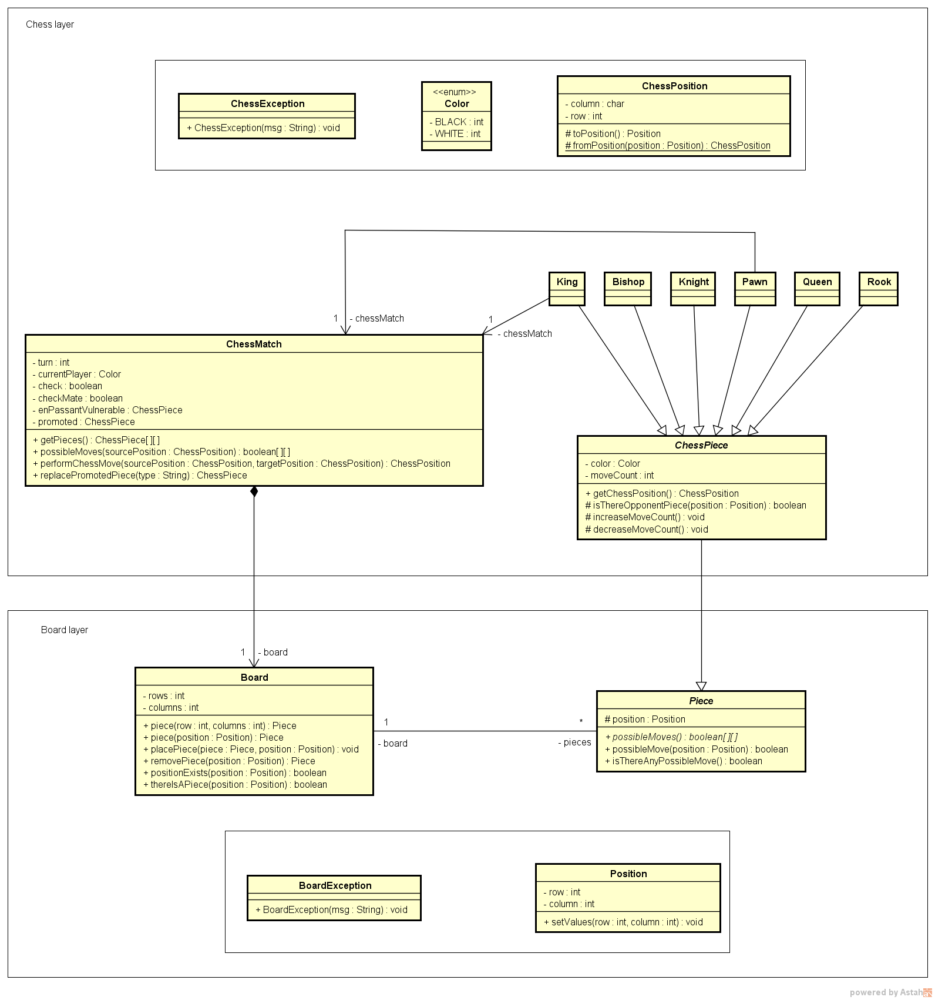
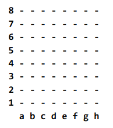

# CLI Chess Game

Implement a chess game for the cli.
This project's goal is to cover the following topics:

    - Enumerations
    - Encapsulation / Access Modifiers
    - Inheritance
    - Downcasting
    - Static members
    - Layers pattern
    - Matrix data structure
    - Inheritance
    - Overriding
    - Polymorphism
    - Exceptions
    - Constructors

# System Design

# Chess board

# Dependencies
	- eclipse plugin: ANSI Escape in Console (colorful terminal output)